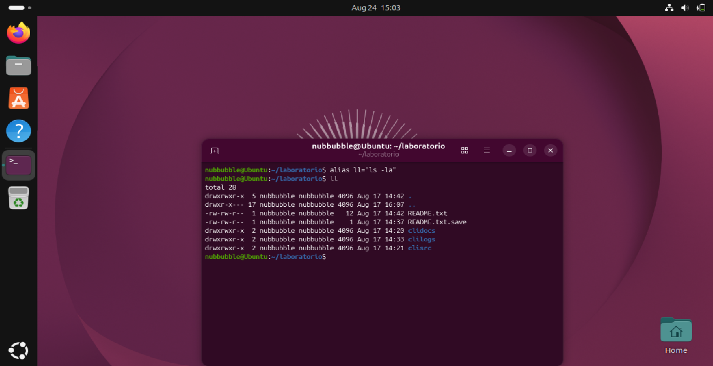
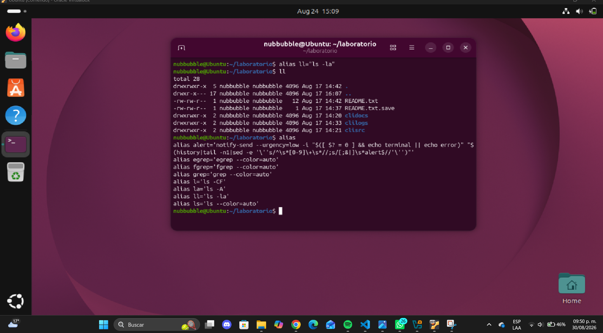

# Comando Alias

En la siguiente imagen se encuentra el comando Alias y una de sus aplicaciones creando ll siendo para ver los permisos que hay en nuestro directorio actual

Enlistamos todos los Alias 
